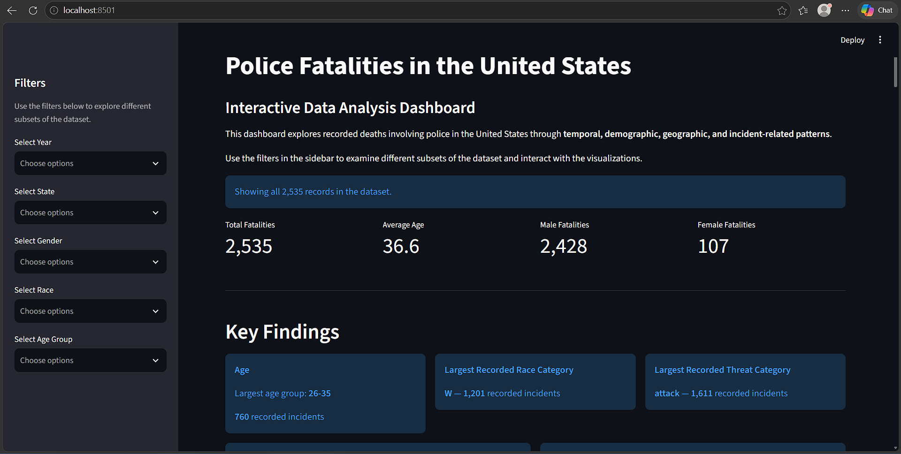

# Fatal Force: Analysis of Police-Involved Fatal Shootings in the United States


# Overview

This project analyzes police-involved fatal shooting data in the United States using Python and data analysis techniques.
The project combines static exploratory analysis in Jupyter Notebook with an interactive Streamlit dashboard that allows users to explore the dataset using multiple filters.

## Interactive Dashboard

The project includes an interactive Streamlit dashboard with dynamic
filters, key findings, and Plotly visualizations.



# Objectives

The main objectives of this project are to:

- Explore patterns in police-involved fatal shootings over time.
- Analyze the demographic characteristics of individuals involved.
- Examine the distribution of fatalities across U.S. states.
- Analyze age, gender, and race distributions.
- Examine threat levels and manner of death.
- Identify temporal patterns by year and month.
- Create an interactive dashboard for exploring filtered subsets of the dataset.
- Practice data cleaning, exploratory data analysis, visualization, and dashboard development.


# Dataset

The project uses a dataset containing recorded deaths involving police in the United States.

The primary dataset contains information including:

- Date
- Name
- Age
- Gender
- Race
- City
- State
- Manner of death
- Armed status
- Threat level
- Flee status
- Signs of mental illness
- Body camera information

The dataset contains 2,535 recorded records in the cleaned project dataset.

The dataset represents recorded incidents available in the source data and should not be interpreted as a complete measure of all deaths involving police.


# Data Cleaning and Preparation

The raw dataset was processed before analysis.

The preprocessing included:

- Converting date values into datetime format.
- Extracting year and month information.
- Extracting month names and days of the week.
- Checking for missing values.
- Checking for duplicate records.
- Creating age groups.
- Creating an `armed_status` classification.
- Preserving missing values where appropriate.
- Creating a canonical cleaned dataset for consistent use across the project.

The final cleaned dataset is stored in:

```
data/processed/canonical_cleaned_data.csv